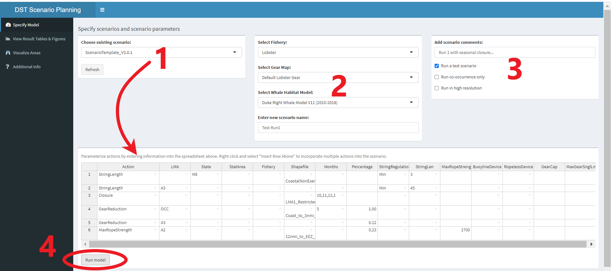
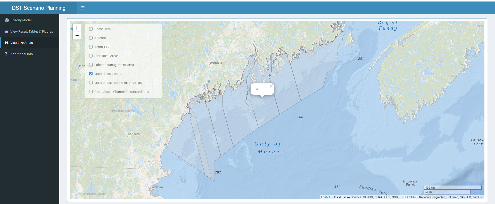
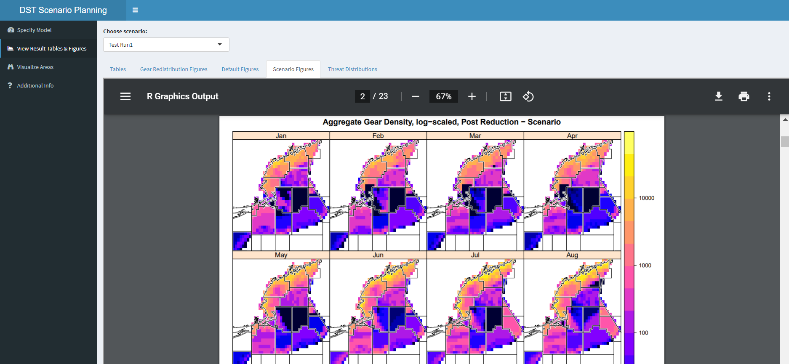

# Decision Support Tool
#### **Atlantic Large Whale Take Reduction Team Decision Support Tool**

### What is this tool used for?
The tool takes the following management measures and modesl how it would change risk to whales:

1.	Seasonal Closures, either with gear removed from the water or allowed to redistribute.
2.	Gear Reductions
3.	Regulations in String Length
4.	Regulations in vertical line characteristics
5.	Implementation of ropeless or timed release technology

### How to use the tool:
For users with [R](https://cran.r-project.org/) and the necessary packages installed on their computers, run the following code to initiate an [R shiny](https://shiny.rstudio.com/) interactive web application.

```
library(shinydashboard)
library(rhandsontable)
library(rgdal)
library(sp)
library(sf)
library(maptools)
library(grid)
library(gtable)
library(gridExtra)
library(shinyjs)
library(leaflet)
library(shinyEffects)
library(stringr)
library(dplyr)
library(rmarkdown)
library(geosphere)
library(lattice)
library(here)

    
shiny::runGitHub("DecisionSupportToolApp", username = "ALoMiller", ref = "master")

```

### Create scenarios and run the model

#### **Specify Model**

Once you have the app up and running, scenarios can be created with the following steps:

1.  Choose to open or modify an existing scenario from the dropdown OR create a new scenario by adding actions to the interactive spreadsheet (more information on defining actions in the "Defining Scenarios"" section below).
2.  Select the type of **Fishery** you are interested in. Based on that fishery, next choose a **Gear Map**. Next, select the **Whale Habitat Model** and enter a new name for your scenario.
3.  Add comments to be noted in the output table (optional) and select from options to **Run a test scenario** (vs. just a default baseline), **Run co-occurrence only** (no gear threat model if checked), and **Run in high resolution** mode (slows model dramatically if checked).
4.  Click **Run Model** to initiate and scroll down for model status updates and warnings which will print below.



#### **Visualize Areas**

To learn more about the spatial extent of different areas (e.g., LMA, StatArea, State waters, etc), click the **Visualize Areas** tab to explore the different spatial domains used in the model.


This map is interactive and can be zoomed and clicked on to learn more about a specific management area.



### Evaluate model output

#### **View Result Tables & Figures**

Once the model finishes running, click on the **View Result Tables & Figures** tab to view results. If more than one scenario has been run during the session, use the **Choose Scenario** dropdown to switch between model results. Click on the various tabs below to view a pdf of the output Tables, Gear Redistribution Figures, Default Figures, Scenario Figures, and Threat Figures. The viewer allows the user to zoom on figures, download, and print. 





### Defining Scenarios								
Each "Action" or row in the input spreadsheet is an independent record that is interpreted by the model function. *Note: Actions are added to the model sequentially (e.g., row 1 is followed by row 2, etc) and the order of the rows may influence the outcome of the model.*

#### **Actions**

In the Action column, select an option from the drop-down list								
Currently implemented: 

*	Constraint_Fishery
*	Constraint_Spatial
*	GearReduction
* GearCap
*	Closure
* StringLength
* MaxGearWSingleLine
* MaxRopeStrength
* Ropeless Device
* NoAction
							
#### **Action input types**

Fill out the rest of the record with the desired inputs. Note that not all columns are applicable all actions and Figure 6. identifies required and optional fields.

*	LMA	- Constrain action to Lobster Management Area						
*	State	- Constrain action to waters off given state						
*	StatArea - Constrain action to statistical area						
*	Fishery - Constrain model run to given fleet						
*	Shapefile - Constrain action to specified input shapefile	
*	Months - Comma delimited text string of months to apply the action over						
*	Percentage - Input percentages for action (i.e. gear reductions, etc.)	


```{r, eval=TRUE}

y <- read.csv(here::here("demo_figures/Lookup.csv"))
knitr::kable(y, format="markdown") %>%
  kableExtra::cell_spec(2:14, background = factor(df, c(0, 1, 2), c("white", "yellow", "blue")))

```

### Example inputs and interpretation

#### **Spatial constraints**

This specifies the spatial domain of the model run. Think of specifications within a line as "ands" and subsequent lines as "ors" so the following would be interpreted as "Constrain the model to (LMA1 and Maine and StatAreas 511 and 512 and the bounds of the 'Example_511_512_Border' shapefile) or (LMA3)". You can have as many records for spatial constraints as desired. The model will use the union of constraints as the domain for the model run.

| Action             | LMA | State | StatArea | Fishery | Shapefile              |
|--------------------|-----|-------|----------|---------|------------------------|
| Constraint_Spatial | A1  | ME    | 511, 512 |         | Example_511_512_Border |
| Constraint_Spatial | A3  |       |          |         |                        |

#### **Fishery constraints** 

This specifies the spatial fleet of the model run. The following interpreted as "constrain the model run to include the NonExempt fishery". You can only specify one fishery constraint							
								
| Action             | Fishery   |
|--------------------|-----------|
| Constraint_Fishery | NonExempt |

#### **Closures** 

This removes all fishing from a region, either seasonally or for the entire year. The following would be interpreted as close the area within 'TinyWedge_LMA1' for May - August. Like spatial constraints, the extent of closures can use the LMA, State, and StatArea columns as well with each field interpreted as an "and"

| Action  | LMA | State | StatArea | Shapefile      | Months  |
|---------|-----|-------|----------|----------------|---------|
| Closure |     |       |          | TinyWedge_LMA1 | 5,6,7,8 |
								
#### **Gear Reductions**

This removes a percentage of traps from a spatial domain. The following would implement a 60% trap reduction in LMA3 and StatArea 515 for the month of May.
								
| Action        | LMA | State | StatArea | Shapefile | Months | Percentage |
|---------------|-----|-------|----------|-----------|--------|------------|
| GearReduction | A3  |       | 515      |           | 5      | 0.6        |


#### **Overview of all options**

All settings that are currently available can be seen below.


|Action             |LMAs        |States |Fishery             | StatArea|StringRegulation |RopelessDevice  |Shapefiles            |
|:------------------|:-----------|:------|:-------------------|--------:|:----------------|:---------------|:---------------------|
|Constraint_Fishery |A1          |ME     |NonExempt           |      464|Min              |TimedRelease    |3nmi_to_12nmi         |
|Constraint_Spatial |A2          |NH     |Exempt              |      465|Max              |AcousticRelease |12nmi_to_EEZ_Boundary |
|GearReduction      |A2_3overlap |MA     |Midshelf_Lobster    |      467|Exactly          |                |Coast_to_3nmi         |
|GearCap            |A3          |       |Midshelf_Crab       |      511|                 |                |                      |
|Closure            |OCC         |       |Offshore_Lobster    |      512|                 |                |                      |
|StringLength       |            |       |Offshore_Crab       |      513|                 |                |                      |
|MaxGearWSingleLine |            |       |EverythingButExempt |      514|                 |                |                      |
|MaxRopeStrength    |            |       |Gillnet             |      515|                 |                |                      |
|RopelessDevice     |            |       |BlueCrab            |      521|                 |                |                      |
|NoAction           |            |       |OtherTrapPot        |      522|                 |                |                      |
|                   |            |       |Dogfish             |      525|                 |                |                      |
|                   |            |       |GB_SNE_CodPollock   |      526|                 |                |                      |
|                   |            |       |GOM_CodPollock      |      533|                 |                |                      |
|                   |            |       |GOM_Haddock         |      534|                 |                |                      |
|                   |            |       |Monkfish            |      537|                 |                |                      |
|                   |            |       |BlackSeaBass_Fed    |      538|                 |                |                      |
|                   |            |       |                    |      539|                 |                |                      |
|                   |            |       |                    |      541|                 |                |                      |
|                   |            |       |                    |      542|                 |                |                      |
|                   |            |       |                    |      552|                 |                |                      |
|                   |            |       |                    |      561|                 |                |                      |
|                   |            |       |                    |      562|                 |                |                      |
|                   |            |       |                    |      611|                 |                |                      |
|                   |            |       |                    |      612|                 |                |                      |
|                   |            |       |                    |      613|                 |                |                      |
|                   |            |       |                    |      614|                 |                |                      |
|                   |            |       |                    |      615|                 |                |                      |
|                   |            |       |                    |      616|                 |                |                      |
|                   |            |       |                    |      621|                 |                |                      |
|                   |            |       |                    |      622|                 |                |                      |
|                   |            |       |                    |      623|                 |                |                      |
|                   |            |       |                    |      625|                 |                |                      |
|                   |            |       |                    |      626|                 |                |                      |
|                   |            |       |                    |      627|                 |                |                      |
|                   |            |       |                    |      631|                 |                |                      |
|                   |            |       |                    |      632|                 |                |                      |
|                   |            |       |                    |      635|                 |                |                      |
|                   |            |       |                    |      636|                 |                |                      |
|                   |            |       |                    |      700|                 |                |                      |
|                   |            |       |                    |      701|                 |                |                      |
|                   |            |       |                    |      702|                 |                |                      |
|                   |            |       |                    |      706|                 |                |                      |
|                   |            |       |                    |      707|                 |                |                      |
|                   |            |       |                    |      708|                 |                |                      |
|                   |            |       |                    |      709|                 |                |                      |
|                   |            |       |                    |      712|                 |                |                      |
|                   |            |       |                    |      713|                 |                |                      |
|                   |            |       |                    |      714|                 |                |                      |
|                   |            |       |                    |      715|                 |                |                      |
|                   |            |       |                    |      717|                 |                |                      |
|                   |            |       |                    |      718|                 |                |                      |
|                   |            |       |                    |      719|                 |                |                      |
|                   |            |       |                    |      722|                 |                |                      |
|                   |            |       |                    |      723|                 |                |                      |
|                   |            |       |                    |      724|                 |                |                      |
|                   |            |       |                    |      727|                 |                |                      |
|                   |            |       |                    |      728|                 |                |                      |
|                   |            |       |                    |      729|                 |                |                      |
|                   |            |       |                    |      732|                 |                |                      |
|                   |            |       |                    |      733|                 |                |                      |
|                   |            |       |                    |      736|                 |                |                      |
|                   |            |       |                    |      737|                 |                |                      |
|                   |            |       |                    |      740|                 |                |                      |
|                   |            |       |                    |      741|                 |                |                      |

## More background information on the tool:

First, because both trap reductions and how traps are aggregated into trawls, the model needs to start at the currency of traps, then sequentially transition to trawls, vertical lines, line diameters, lethality, and then risk based on whale co-occurrence.

Second, it seems appropriate to model these processes at a scale of a 1Nm grid, as this is the finest scale that the IEc model employs, allows splitting stat areas along LMA lines, and allows some added precision to modeling the boundaries of closed areas. Much of the other model inputs do not have this resolution so we’ll have to accept simple down-scaling of these processes.

Tool layout:
1.	Start with traps per grid by month. This is calculated from the Area 3 Vertical Line model as a function of the number of vertical lines and trawl lengths. For Area 3, this need to be modeled separately for the crab and lobster fishery with two different classes of lobster vessels.
2.	Traps are removed or redistributed based on the locations and timing of seasonal closures (management option #1 above). We would need to consider a rough approach to how to model redistributing traps. We can start with a basic set of rules for now.
3.	Traps are further removed due to trap reductions (management option #2). Easiest assumption is that traps will be removed proportionally over the entire management area.
4.	Traps are converted to distribution of trawls based on existing empirical data or models of traps / trawl at the scale of stat areas and proposed management (#3 above).
5.	Trawls are converted to vertical lines based on trawl length. Expected to be two vertical lines per trawl for all offshore areas but may be different for inshore areas with shorter trawls.
6.	Number of vertical lines are further adjusted for any regulations on ropeless or timed-release fishing (#5 above). Given the technology available to the lobster fishery and other fisheries, it is improbable that these measures can be implemented immediately but it is appropriate to include this now in the model framework.
7.	A distribution of line diameters for vertical lines is characterized based on observed relationships with trawl length and further modified based on management options (#4 above).
8.	Line diameters are converted to lethality based on a model to be developed, possibly by polling the TRT.
9.	Lethality for the grid cell is calculated as the product of line lethality and number of vertical lines.
10.	Risk is calculated as the product of lethality and whale presence.
11.	Grids are then aggregated to appropriate scales to get risk scores by 10min cells, stat areas, LMA’s, etc.
12.	Aggregate risk scores are then be compared to a baseline risk value to determine risk reduction.


*This repository is a scientific product and is not official communication of the National Oceanic and Atmospheric Administration, or the United States Department of Commerce. All NOAA GitHub project code is provided on an ‘as is’ basis and the user assumes responsibility for its use. Any claims against the Department of Commerce or Department of Commerce bureaus stemming from the use of this GitHub project will be governed by all applicable Federal law. Any reference to specific commercial products, processes, or services by service mark, trademark, manufacturer, or otherwise, does not constitute or imply their endorsement, recommendation or favoring by the Department of Commerce. The Department of Commerce seal and logo, or the seal and logo of a DOC bureau, shall not be used in any manner to imply endorsement of any commercial product or activity by DOC or the United States Government.*
